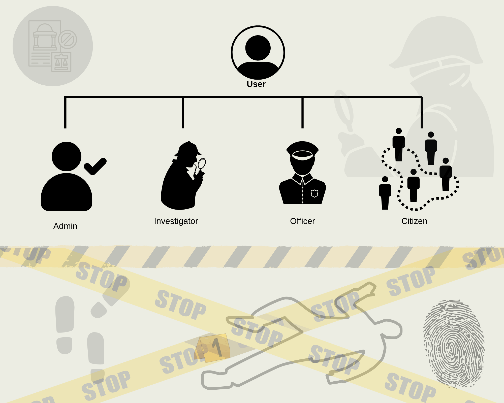
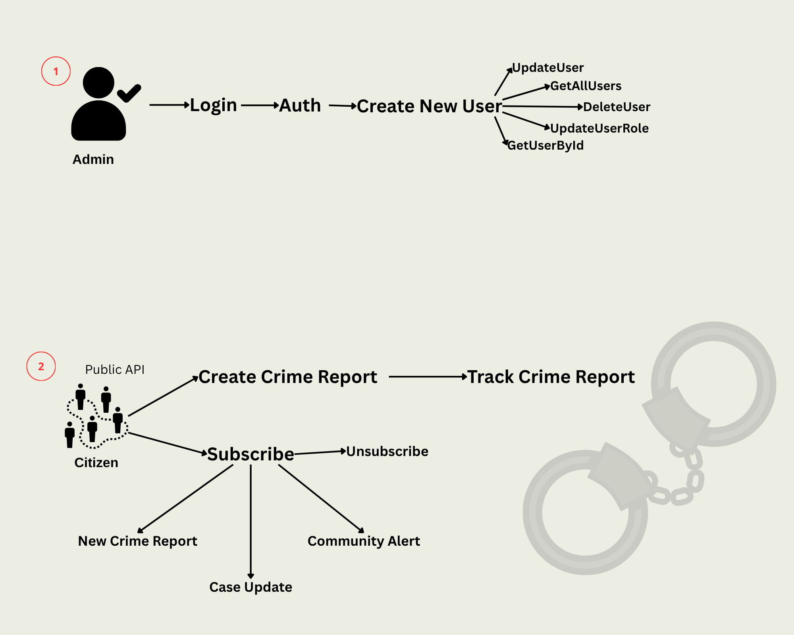
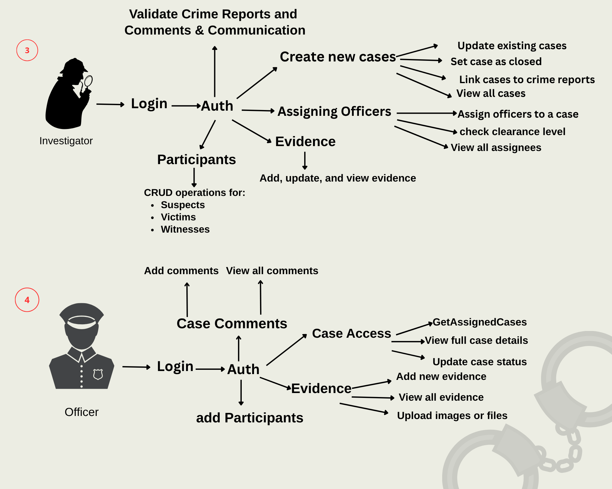

# Crime Management System – ASP.NET Core Web API

Backend API for managing **crime cases**, **reports**, **evidence**, and **users** for *District Core*.  
Built as part of the **Rihal Codestacker Challenge 2025 (Backend)** using **ASP.NET Core** and **Entity Framework Core**.

---


## 📘 Overview  

The **Crime Management System** is a backend API that enables multiple user roles — **Admins**, **Investigators**, **Officers**, and **Citizens** — to report, manage, and track crime cases in District Core.  

It ensures:
- ✅ **Data integrity**  
- 🔒 **Security & Audit logging**  
- 🧩 **Clear role-based permissions**  
- ✉️ **Email alerts & case commenting**

---

## 🧩 System Architecture  

| Controller | Description |
|-------------|-------------|
| **AuthController** | Handles login and JWT authentication. |
| **UserController** | Admin-only user management (create, update, assign roles & clearance). |
| **CrimeReportsController** | Citizens report and track crimes (public endpoints). |
| **CaseController** | Create, update, list, and view detailed crime cases. |
| **CaseAssigneesController** | Investigators assign officers to cases. |
| **ParticipantsController** | Manage suspects, victims, witnesses, and link them to cases. |
| **EvidenceController** | Add, view, update, soft-delete, and hard-delete evidence. |
| **CaseCommentsController** | Add, retrieve, and delete case comments (with validations & rate limiting). |
| **CitizenSubscriptionsController** | Manage citizen subscriptions to city crime alerts. |
| **AlertsController** | Admin sends community email alerts to subscribed citizens. |

---

## STORYBOARD 





--- 

## 🧭 Usage / System Flow  

This section explains how each role uses the system, from public crime reporting to case resolution.

---

### 🧑‍🤝‍🧑 **1️⃣ Citizen Flow (Public Access)**  

**Purpose:**  
Citizens can report crimes, track their progress, and subscribe for safety alerts.

| Action | Endpoint | Authentication |
|---------|-----------|----------------|
| Report a crime | `POST /api/CrimeReports` | ❌ Public |
| Track report status | `GET /api/CrimeReports/GetReportStatus?reportId=...` | ❌ Public |
| Subscribe to alerts | `POST /api/CitizenSubscriptions/subscribe` | ❌ Public |
| Unsubscribe | `POST /api/CitizenSubscriptions/unsubscribe?email=...` | ❌ Public |

**Process:**
1. Citizen submits a crime report.  
2. The system generates a unique `reportId`.  
3. Admins/Investigators are notified via email.  
4. Citizen tracks progress anytime using the report ID.

---

### 🕵️‍♀️ **2️⃣ Investigator Flow (Authorized Access)**  

**Purpose:**  
Investigators handle reports, create cases, assign officers, and manage evidence.

| Action | Endpoint | Role |
|---------|-----------|------|
| Create case from report | `POST /api/Cases` | Investigator |
| Assign officer to case | `POST /api/CaseAssignees/assign-officer` | Investigator |
| Add participants | `POST /api/Participants/add-to-case` | Investigator |
| Manage evidence | `POST /api/Evidence/CreateTextEvidence`, `DELETE /api/Evidence/soft-Delete` | Investigator |
| Comment on case | `POST /api/CaseComments/add` | Investigator |

**Process:**
1. Investigator logs in via `/api/Auth/login`.  
2. Creates a case linked to crime reports.  
3. Assigns officers based on clearance level.  
4. Adds participants and evidence.  
5. Posts updates and comments on case progress.  
6. Citizens and officers are notified by email when updates occur.

---

### 👮 **3️⃣ Officer Flow (Authorized Access)**  

**Purpose:**  
Officers view assigned cases, upload evidence, and add investigation comments.

| Action | Endpoint | Role |
|---------|-----------|------|
| View assigned cases | `GET /api/Cases` | Officer |
| Upload evidence | `POST /api/Evidence/CreateImageEvidence` | Officer |
| Add comments | `POST /api/CaseComments/add` | Officer |

**Process:**
1. Officer logs in.  
2. Views assigned cases.  
3. Uploads evidence (text or image).  
4. Adds comments with timestamps.  
5. Officers cannot delete participants or evidence.

---

### 👨‍💼 **4️⃣ Admin Flow (Full Control)**  

**Purpose:**  
Admins manage all users, roles, and system-wide alerts.

| Action | Endpoint | Role |
|---------|-----------|------|
| Manage users | `POST /api/User`, `PUT /api/User/UpdateUserByID` | Admin |
| Assign roles & clearance | `PUT /api/User/role` | Admin |
| Delete users | `DELETE /api/User/DeleteUser?id=...` | Admin |
| Send community alert | `POST /api/Alerts/community-alert` | Admin |

**Process:**
1. Admin logs in via `/api/Auth/login`.  
2. Manages user roles and permissions.  
3. Sends community safety alerts via email.  
4. Reviews all actions through audit logs.

---

## ⚙️ System Flow Diagram  

```text
 ┌────────────────────────────┐
 │        CITIZEN (Public)   │
 │────────────────────────────│
 │ • Report a crime           │
 │ • Track report status      │
 │ • Subscribe to alerts      │
 └──────────────┬─────────────┘
                │
                ▼
       ┌────────────────────────┐
       │    ADMIN / INVESTIGATOR│
       │────────────────────────│
       │ • Create & manage cases│
       │ • Assign officers      │
       │ • Add participants     │
       │ • Update case status   │
       └────────────┬───────────┘
                    │
                    ▼
           ┌─────────────────┐
           │    OFFICER      │
           │─────────────────│
           │ • View assigned │
           │   cases         │
           │ • Upload        │
           │   evidence      │
           │ • Add comments  │
           └───────┬─────────┘
                   │
                   ▼
          ┌──────────────────────┐
          │   EVIDENCE MODULE    │
          │──────────────────────│
          │ • Upload / Delete    │
          │ • Audit logging      │
          └────────┬─────────────┘
                   │
                   ▼
        ┌──────────────────────────┐
        │ EMAIL NOTIFICATION SYSTEM│
        │──────────────────────────│
        │ • New crime alerts       │
        │ • Case updates           │
        │ • Community broadcasts   │
        └──────────┬───────────────┘
                   │
                   ▼
         ┌────────────────────────┐
         │  CITIZENS (Subscribers)│
         │────────────────────────│
         │ Receive safety alerts  │
         │ via email notifications│
         └────────────────────────┘

   ```


## ✉️ Email Notification System  

The system automatically sends emails to keep both citizens and officials informed about key events.

### **📨 Event Triggers**

| Event | Trigger |
|--------|----------|
| **New Crime Report** | Notifies **Admins** and **Investigators** about newly submitted crime reports. |
| **Case Update** | Notifies **Citizens** and **Assigned Officers** when case details or status change. |
| **Community Alert** | Allows **Admins** to send city-wide safety alerts to all **subscribed citizens**. |

---

### **🌐 Public Endpoints**

| Action | Endpoint | Description |
|---------|-----------|-------------|
| **Subscribe** | `POST /api/CitizenSubscriptions/subscribe` | Citizens can subscribe to receive city-specific safety alerts. |
| **Unsubscribe** | `POST /api/CitizenSubscriptions/unsubscribe?email=example@email.com` | Citizens can unsubscribe from receiving alerts. |

---
## 💬 Case Commenting Rules  

The **Case Commenting** feature allows officers and investigators to exchange updates and insights within a case while maintaining clear rules for content and posting frequency.

---

### **📝 Comment Validation Rules**

| Rule | Description |
|-------|--------------|
| **Length** | Must be between **5–150 characters**. |
| **Allowed Characters** | Letters, numbers, and basic punctuation (`. , ! ? ' -`). |
| **Disallowed** | HTML tags, code snippets, or any special characters. |
| **Rate Limit** | Maximum **5 comments per user per minute** to prevent spam. |

---


## 👥 Contributors

- **[Mathla Salim Alwahaibi](https://github.com/MathlaALw)**  
- **[Rehab AlNairi](https://github.com/Rehabalnairi)**